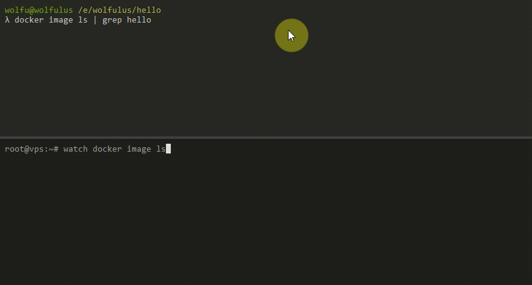

# Docker Transfer

## What is it?

Transfer is a docker CLI plugin that enables pushing images directly to a remote docker host, skipping the process of pushing to an intermediate registry.




## Why?

I don't really like repeating stuff, so this process might sound familiar to you:

-   Build image
-   Push image
-   Go to vps
-   Pull image

Using transfer this boils down to:

-   Build image
-   ~~Push~~ transfer image

And the image is now available on your remote host.

## How it works?

Transfer contains two components: a service (preconfigured registry server) and a CLI. The service enables you to push images with layer caching and all the good stuff registry has, and CLI adds some commands to your docker client to push images and manage the service instance.

### Registry

Transfer builds directly from `docker/distribution` source repository, it just adds a new go package before the build, that acts as a notification handler (so it knows when an image gets pushed - this is where the image gets restored on the host machine). It also enables `htpasswd` authentication by default, and users can be managed through the CLI.

### CLI

The CLI can act as a standalone CLI or as a docker plugin. It allows you to push and manage the transfer service with simple commands.

# Installation

### Install the service

A full installation process will be available through the CLI, but for now it's recommended to run it through a `docker-compose` file.

```yaml
version: "3.7"

# Services
services:
    # Registry
    registry:
        image: wolfulus/transfer:v0.0.2
        restart: unless-stopped
        ports:
            # "PUBLIC:5000"
            - "5000:5000"
        environment:
            # This should match the (public) port above
            # The container port will always run on port 5000
            TRANSFER_SERVICE_PORT: "5000"
            TRANSFER_MANAGEMENT_USERNAME: "wolfulus"
            TRANSFER_MANAGEMENT_PASSWORD: "yourpassword"
        labels:
            # Required for service detection
            - com.wolfulus.transfer.version=v0.0.2
            - com.wolfulus.transfer.managed=no
        volumes:
            # Contains the htpasswd file
            - ./data/auth/:/data/auth/
            # Stores the layer cache
            - ./data/registry/:/var/lib/registry/
            # Required to interact with docker
            - /var/run/docker.sock:/var/run/docker.sock
```

### Install the CLI

Download the CLI release from GitHub that matches the service you installed on the server. The `docker-transfer` executable should be put into your `~/.docker/cli-plugins` directory and permission set to `+x`. On windows (Docker for Windows), the executable should be put in `C:\Users\<your-user>\.docker\cli-plugins`.

There are no automatic installation scripts right now.

> NOTE: you should do this for both the server and the client.

### Login into the registry

You can login to your registry (just make sure the service port is exposed and accessible before trying to)

`docker login service.address:5000`

### Make an easy alias

This step is optional, but you can create an alias on your CLIENT machine using

`docker transfer alias vps service.address:5000`

Now whenever you want to push an image, you can target `vps` instead of `service.address:5000`. This is very useful when dealing with IP addresses and ports.

### Transfer an image

Make sure you have an image to transfer to the target machine and push it to your host using `docker transfer image` command.

Usage:

`docker transfer image host image[:tag]`

For example (using the above alias):

`docker transfer image vps nginx`

After pushing, the image will be available on the host as `nginx`

### Test it

On your host machine (assuming you didn't have an nginx machine there yet), check if the image got restored with `docker image ls | grep nginx`

## FAQ

:shrugs:
